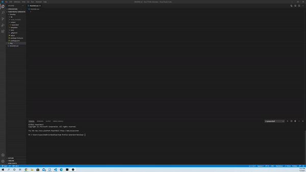
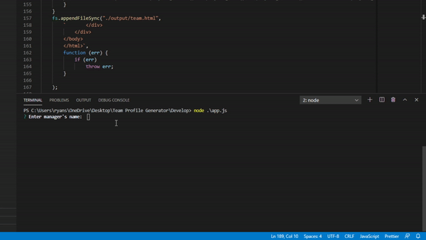
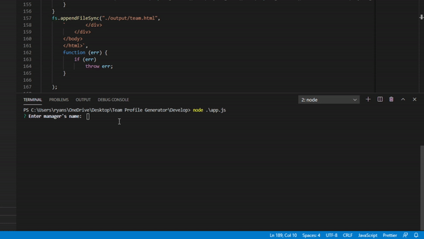
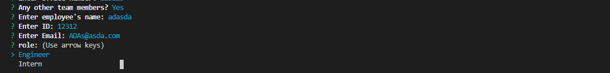
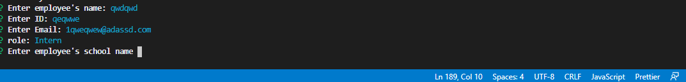
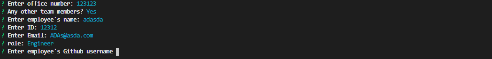

# Team Profile Generator

## Demonstration 



https://www.youtube.com/watch?v=2i0SNlrxkEk

## Introduction

Have the user create their own employee generator of their workers by using npm manipulation in node js. Using the prompt will create a list of workers for the user to list their employees.

## How it works 

The user must run.

```node app.js```

Once it's run in the node terminal you will be asked a series of question. It will begin asking about your manager.

This will ask for your manager's:
* Name
* ID
* Email
* Room Number

NOTE: This will only ask once since most workplaces have at least 1 manager.




NOTE: You must put in an email before proceeding otherwise you will be left with an error. Additionally no inputs means no continuation. 

Once the process is finished the terminal will ask you if you have any other workers. If the user say no the website will automatically generate the user with only the manager. If chosen Yes then it will have the user create a new employee.



It will display just like the manager, but it will instead ask the user to choose an employee of choice.



If the user chose intern it will ask the user for the employee's school name 



If the user chose engineer it will ask for the employee's Github

Once the user lists all of their employees, the user can stop generating by saying "No" when being notified if the user wants to add more or not.
